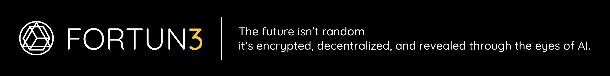

# Fortun3 🔮✨

Fortun3 is a revolutionary blockchain-powered horoscope platform that combines artificial intelligence with blockchain technology to provide personalized astrological insights. Users can exchange USDC for F3 tokens to consult the digital prophet about their destiny using various sources of destiny like **wallet addresses, transaction hashes, timestamps, and more**. Each consultation mints a unique Destiny NFT stored on IPFS

> "The future isn't random — it's encrypted, decentralized, and revealed through the eyes of AI."

## 📑 Table of Contents

- [Features](#features)
- [The Prophet AI Agent](#the-prophet-ai-agent)
- [Architecture](#architecture)
  - [User Journey](#user-journey)
  - [Backend Logic](#backend-logic)
  - [AI & Storage](#ai--storage)
  - [Output](#output)
- [Getting Started](#getting-started)
  - [Prerequisites](#prerequisites)
- [How It Works](#how-it-works)
  - [Exchange & Payment](#1-exchange--payment)
  - [Submit Your Destiny](#2-submit-your-destiny)
  - [AI Consultation](#3-ai-consultation)
  - [NFT Prophecy](#4-nft-prophecy)
- [Technology Stack](#technology-stack)
- [Token Economics](#token-economics)
- [Links](#links)
- [Acknowledgments](#acknowledgments)
- [AI Animation](#ai-animation)

## 🌟 Features

- **Token Exchange**: Convert USDC to F3 tokens for horoscope consultations
- **Multi-source Destiny Reading**:
  - Wallet Address Analysis
  - Transaction Hash Interpretation
  - Date/Time-based Predictions
- **AI-Powered Predictions**: Advanced AI algorithms analyze blockchain data for meaningful insights
- **Smart Contract Integration**: Secure and transparent token transactions
- **Personalized Horoscope**: Get unique insights based on your chosen destiny source
- **Prophecy as NFT**: Each consultation mints a unique Destiny NFT stored on IPFS
- **History Tracking**: Access your past prophecies

## 🔮 The Prophet AI Agent

The AI agent interprets user-submitted prompts in combination with selected blockchain data (wallet, tx, timestamp). It responds in:

- Text (short + long form)
- Voice (optional text-to-speech)
- NFT Metadata (stored on-chain/IPFS)

## 🏗️ Architecture

Our system architecture is designed for scalability, security, and seamless user experience:

This architecture illustrates the end-to-end flow of the Fortun3 decentralized horoscope platform, where users exchange tokens, submit prompts, and receive personalized AI-generated prophecies—secured on-chain and stored via IPFS.

### User Journey

There are two main user flows:

1. Web3 Horoscope Consultation Flow
   The User connects to the Web Frontend or World Mini App

- Exchanges USDC to F3 tokens

- Pays F3 to consult the Prophet

- The frontend calls the pay function (with a ticket ID)

- The Watcher watches the CounterService contract for the payment event

- A Watcher detects the payment and sends the ticket ID to the Backend

2. AI Prompt Submission Flow

- The User (via an MCP Client like OpenAI or Claude desktop) submits a prompt

- The prompt is sent to the MCP Server, which sends a ticket request to the Backend

### Backend Logic

- The Backend verifies the ticket

- It fetches relevant on-chain data (wallet, transaction hash, timestamp)

- Uses third-party APIs like Nodit, 1inch, BlockScout, or Etherscan

- The data is sent to The Prophet AI Agent for analysis

- The AI generates a personalized horoscope result

### AI & Storage

- The AI result is returned to the backend

- The result is stored on IPFS

- A Relayer is triggered to mint a Destiny NFT

- The NFTMinter Contract mints the NFT and sends it to the user's wallet

### Output

The User receives: Their prophecy result in text or voice and A minted Destiny NFT

## 🚀 Getting Started

### Prerequisites

- MetaMask or any Web3 wallet
- USDC tokens for initial exchange
- EVM network access

## 🚀 How It Works

### 1. Exchange & Payment

- Connect your wallet (e.g., MetaMask)
- Swap USDC → F3 tokens (1:1)
- Use 1 F3 token to request a consultation

### 2. Submit Your Destiny

- Choose your source of destiny:
  - Wallet Address
  - Transaction Hash
  - Timestamp
- Optionally, submit a personal prompt

### 3. AI Consultation

- Prophet AI Agent analyzes the source and generates your fortune
- Backend fetches on-chain data and forwards to AI
- The result is stored as text and optionally voice on IPFS

### 4. NFT Prophecy

- A unique Destiny NFT is minted and sent to your wallet
- You can revisit your prophecy anytime

## 🔮 Technology Stack

- **Frontend**: React.js
- **Backend**: Nestjs
- **Smart Contracts**: Solidity
- **Blockchain**: EVMs
- **AI/ML**: OpenAI, n8n
- **Token Standard**: ERC-20

## 📊 Token Economics

- **Token Name**: F3 Token
- **Token Standard**: ERC-20
- **Initial Exchange Rate**: 1 USDC : 1 F3
- **Consultation Cost**: 1 F3 token

## 🌐 Links

- [Website](https://fortun3.guru)

## 🙏 Acknowledgments

- ETHGlobal Hackathon

## AI Animation

About this ai animation we used the [KlingAI](https://app.klingai.com/) to generate the animation video.

## 

Built with ❤️ at ETHGlobal Hackathon TAIPEI
